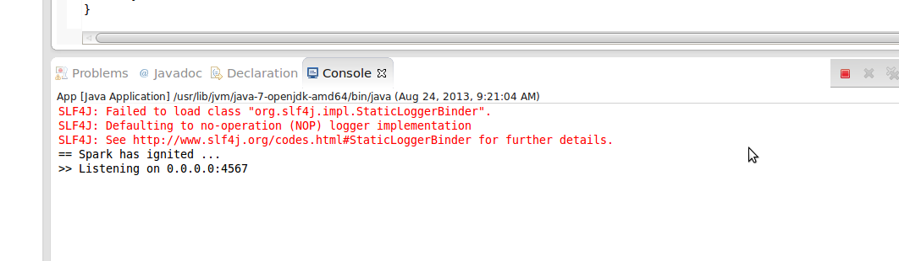

#	Playing with REST , Spark and curl

##	What is Spark?

*	Spark is a framework for creating web applications in java 

*	Lightweight and inspired by Ruby Sinatra

##	What is curl?

*	An extremely useful utility in *nix operating systems to interact with a lot of things on web

* 	Important tool in a testers kitty to test rest services among other things

##	Trying the spark hello world application from google code 

I am going to try the code that is hosted on google 

###	Setting up a maven project

I use eclipse as my ide and set up a simple maven project and added these dependencies for spark

```xml
    <dependency>
      <groupId>com.sparkjava</groupId>
      <artifactId>spark-core</artifactId>
      <version>1.1</version>
    </dependency>
```

This is the example that I copied and modified from the google code page

```java
package com.sk176h.rest.spark;
import static spark.Spark.get;
import spark.Request;
import spark.Response;
import spark.Route;

public class App{

	public static void main(String[] args) {
	      
	      get(new Route("/hello") {
	         @Override
	         public Object handle(Request request, Response response) {
	            return "Hello World!";
	         }
	      });

	   }

}
```

`get` comes from the static import from Sinatra and takes a Route object as a parameter

We then define a nested innerclass which extends Route and override the handle method which accepts `Request` and `Response` object as parameters 

In this simple example we just return the string Hello World 

Run this example by right clicking on your eclipse and running it as a **java application**  there is no complex xml setup or server setup needed to run this simple application unlike most other java frameworks 


This is what you will see in your eclipse when your application runs 



This is exactly how sinatra works. You write a simple code and execute it and you have a web application running

In this trial we have finally managed to get the ***spark ignited***

##	Testing our simple web application using curl 

* 	Make sure you have curl installed on your machine.  On your Ubuntu/Mint box you can simply say `sudo apt-get install curl` 

*	Fire up your terminal and type the command `curl http://localhost:4567/hello`  and you should get `"Hello World!"` in your output 
like this


##	Playing with parameters

Now that we have got our basic skeleton for our webapp set lets explore some more.

Lets add a url parameter to our hello world application so that it takes the name of a user and greets the user. The modified code
looks like this 

```java
public class App {
	public static void main(String[] args){

		get(new Route("/hello/:name"){
			@Override
			public Object handle(Request request, Response response) {
				return String.format("Hello %s!!! How have you been \n",
						request.params("name"));
			}
		});

	}
}
```

We can now test out application by restarting it and issuing a curl request like this : `curl http://localhost:4567/hello/sk176h` 
and this is how our output looks like 


Spark also allows us to specify wildcarded parameters which can be accessed as an array by calling the `.splat()` method 

```java
get(new Route("/say/*/to/*"){
	@Override
	public Object handle(Request request, Response response) {				
		String str = String.format("Your first parameter was %s",request.splat()[0]);
		str += String.format("\nYour second parameter was %s",request.splat()[1]);
		return str;
	}			
});
```

`curl http://localhost:4567/say/hello/to/world` presents this output

```
Your first parameter was hello
Your second parameter was world
```

Query params passed to the url can be accessed using the `.queryParams()` method of the request object

```java
get(new Route("/sayhelloto"){
	@Override
	public Object handle(Request request, Response response) {				
		return "hello  " + request.queryParams("name");
	}
});		
```
##	Trying other REST operations

The other rest operations are excatly similar to get in Spark. Just substitute the `get` with `post` , `put` and `delete`

```java
public class App {
	public static void main(String[] args) {
				
		get(new Route("/hello") {			
			@Override
			public Object handle(Request request, Response response) {
				return "you did a get operation on /hello";
			}
		});		
		
		post(new Route("/hello") {			
			@Override
			public Object handle(Request request, Response response) {
				return "you did a post operation on /hello";
			}
		});
		
		
		put(new Route("/hello") {			
			@Override
			public Object handle(Request request, Response response) {
				return "you did a put operation on /hello";
			}
		});
		
		delete(new Route("/hello") {			
			@Override
			public Object handle(Request request, Response response) {
				return "you did a delete operation on /hello";
			}
		});		
	}
}
```

##	Issuing other REST commands with curl 

`GET` is the default operation when we run curl as `curl http://someurl:port/somepath` 

To specify a different operation use the -X switch or --request switch with curl and specify one of the operation 
`GET` , `POST` , `PUT` or `DELETE`

Here is the output with the -X switch 


Here is the output with the --request switch


##	Accessing data in a Spark application 

We have gone through creating resources for each of the operations but none of them accept any data. In regular REST services a payload
is associated with PUT and POST operations 

Data sent to these operations can be accessed as a String by the `.body()` method of the `Request` object

Here is the modified code that accesses the data sent as a payload 


```java
	put(new Route("/hello") {			
		@Override
		public Object handle(Request request, Response response) {				
			return "you did a put operation on /hello" + 
			" with data " + request.body() + "\n" ;
		}
	});

	post(new Route("/hello") {			
		@Override
		public Object handle(Request request, Response response) {
			return "you did a post operation on /hello" + 
					" with data " + request.body() + "\n" ;
		}
	});

```

##	Sending data to REST services using curl 

Use the --data switch to send data to curl. Lets test sending data to our application with the modified code


##	Setting response codes in Spark

REST has a set of predefined response codes that you want to set to provide meaningful metadat about the status of operation

e.g. 200 is used if the GET operation is successful while 404 denotes that the resource that was being requested does not exist

A response code can be set by using the `.status` method of the `Response` object. Example shown below 

```java
post(new Route("/hello") {			
	@Override
	public Object handle(Request request, Response response) {				
		response.status(201);
		return "you did a post operation on /hello" + 
				" with data " + request.body() + "\n" ;
	}
});
```

##	Getting curl to display response codes

Use the `-v` flag in curl to display the request and response data which contains the status code returned by the server

use the `-i` flag in curl to display the response data which contains the status code returned by the server


